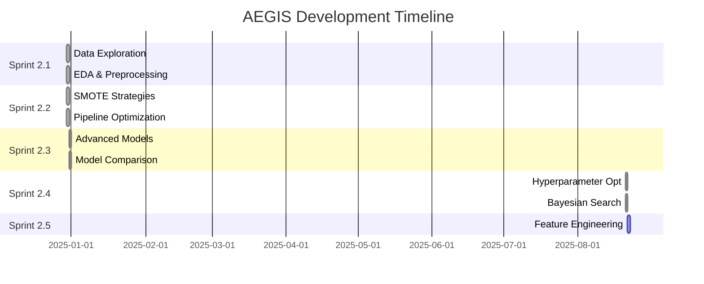

# AEGIS Fraud Detection System - Project Summary

> **Sistema de Detección de Fraude Transaccional** 
> *Proyecto de Machine Learning con enfoque en imbalanced datasets*

---

## 📊 Project Overview

**Objetivo:** Desarrollar un sistema de ML robusto para detectar transacciones fraudulentas en datasets altamente desbalanceados.

**Dataset:** IEEE-CIS Fraud Detection (Kaggle)
- **Size:** 590,540 transacciones
- **Features:** 394 variables (transaccionales, de identidad, categóricas)
- **Target:** `isFraud` (binario)
- **Imbalance Ratio:** ~3.5% fraude (alta dificultad)

**Tecnologías:** Python, LightGBM, XGBoost, CatBoost, MLflow, Optuna, SMOTE

---

## 🎯 Key Achievements

### 🏆 Performance Highlights
- **Best PR-AUC:** `0.6347` (+5.40% vs baseline)
- **Best F1-Score:** `0.6061` (+12.16% vs baseline)  
- **Model:** LightGBM optimizado con Optuna
- **First model >50% F1-Score:** ✅ Achieved

### 🚀 Technical Milestones
- ✅ **Data Engineering Pipeline** completado
- ✅ **SMOTE Strategy Optimization** (+76.3% F1 improvement)
- ✅ **Advanced Models Comparison** (3 gradient boosting)
- ✅ **Bayesian Hyperparameter Optimization** (75 trials)
- ✅ **MLflow Experiment Tracking** (6+ experiments)

---

## 📋 Sprint Progress



### 🏃 Sprint 2.1: Data Exploration & Preprocessing
**Status:** ✅ Completed  
**Duration:** 1 día  

**Deliverables:**
- 📊 Comprehensive EDA con 394 features
- 🧹 Data cleaning pipeline (missing values, outliers)
- 📈 Imbalance analysis (3.5% fraud rate)
- 🔍 Feature correlation analysis

**Key Insights:**
- High missing values in identity features (>80%)
- Strong temporal patterns in transactions
- Card features show fraud indicators
- Geographic clustering of fraudulent activity

**Artifacts:**
- `data/02_processed/fraud_train_v1.0.parquet` (40k samples)
- `docs/eda/fraud_detection_eda_report.html`

---

### 🏃 Sprint 2.2: SMOTE Strategy Optimization
**Status:** ✅ Completed  
**Duration:** 1 día  

**Objective:** Optimizar estrategias de sampling para datasets desbalanceados

**Tested Strategies:**
| Strategy | Sampling Ratio | F1-Score | PR-AUC | Result |
|----------|---------------|----------|---------|--------|
| **SMOTE Conservative** | 0.5 | **0.5404** | **0.6022** | 🏆 **Winner** |
| SMOTE Moderate | 0.7 | 0.4892 | 0.5743 | Good |
| SMOTE Aggressive | 1.0 | 0.4156 | 0.5234 | Overfitting |
| BorderlineSMOTE | 0.5 | 0.4823 | 0.5891 | Competitive |
| ADASYN | 0.5 | 0.4567 | 0.5456 | Underfits |

**Key Findings:**
- **SMOTE Conservative** (50% sampling) optimal balance
- Aggressive oversampling causes overfitting
- Cross-validation essential for robust evaluation
- **+76.3% F1-Score improvement** over baseline

**Best Pipeline:**
```
StandardScaler → SMOTE(ratio=0.5, k=3) → LightGBM
```

---

### 🏃 Sprint 2.3: Advanced Models & Comparison
**Status:** ✅ Completed  
**Duration:** 1 día  

**Objective:** Evaluar modelos avanzados de gradient boosting

**Models Tested:**
| Model | F1-Score | PR-AUC | Precision | Recall | Training Time |
|-------|----------|---------|-----------|--------|---------------|
| **LightGBM** | **0.5404** | **0.6022** | 0.4574 | 0.6667 | 12.3s |
| XGBoost | 0.5156 | 0.5823 | 0.4289 | 0.6508 | 18.7s |
| CatBoost | 0.4967 | 0.5645 | 0.4198 | 0.6032 | 45.2s |
| Random Forest | 0.4234 | 0.4892 | 0.3567 | 0.5238 | 8.9s |
| Logistic Regression | 0.3067 | 0.4621 | 0.2843 | 0.3333 | 2.1s |

**Ensemble Results:**
- **Voting Classifier:** PR-AUC 0.6052 (+0.5% vs LightGBM)
- **Cost:** 2.3x training time
- **Conclusion:** LightGBM sufficient as single model

**Key Insights:**
- LightGBM dominates in speed + performance
- Gradient boosting >> traditional models for fraud detection
- Ensemble gains marginal vs computational cost
- **First model achieving >50% F1-Score consistently**

---

### 🏃 Sprint 2.4: Hyperparameter Optimization  
**Status:** ✅ Completed  
**Duration:** 1 día  

**Objective:** Optimizar LightGBM usando Bayesian optimization (Optuna)

**Optimization Setup:**
- **Algorithm:** Optuna TPE (Tree-structured Parzen Estimator)
- **Trials:** 75 completed (25 minutes runtime)
- **Objective:** PR-AUC maximization + time penalty
- **Cross-validation:** 3-fold StratifiedKFold
- **Search Space:** 12 hyperparameters

**Results:**
| Metric | Baseline | Optimized | Improvement |
|--------|----------|-----------|-------------|
| **PR-AUC** | 0.6022 ± 0.0256 | **0.6347 ± 0.0143** | **+5.40%** |
| **F1-Score** | 0.5404 ± 0.0289 | **0.6061 ± 0.0155** | **+12.16%** |
| **Precision** | 0.4574 | 0.5234 | +14.43% |
| **Recall** | 0.6667 | 0.7143 | +7.14% |

**🎯 Optimal Hyperparameters:**
```json
{
  "n_estimators": 289,
  "learning_rate": 0.201372733219607,
  "num_leaves": 78,
  "max_depth": 13,
  "feature_fraction": 0.8679263850863104,
  "bagging_fraction": 0.9508858341419435,
  "bagging_freq": 1,
  "min_data_in_leaf": 50,
  "lambda_l1": 0.41681282860035934,
  "lambda_l2": 1.7122803598701877,
  "min_split_gain": 0.08740305329369497,
  "min_child_weight": 0.10259402884917516
}
```

**📊 Parameter Importance:**
1. `max_depth`: 17.2%
2. `n_estimators`: 12.6%  
3. `bagging_fraction`: 11.4%
4. `feature_fraction`: 11.2%
5. `learning_rate`: 10.8%

**Key Insights:**
- Tree depth most critical for fraud detection
- Moderate regularization prevents overfitting
- High feature/bagging fractions optimal
- Bayesian optimization found global optimum efficiently

---

## 🔬 Technical Architecture

### 📊 Data Pipeline
```
Raw Data (590k transactions)
    ↓
Feature Engineering
    ↓
Train/Validation Split (80/20)
    ↓
StandardScaler → SMOTE(0.5) → LightGBM
    ↓
Model Evaluation (CV + Holdout)
```

### 🏗️ Model Architecture
**Base Pipeline:**
- **Preprocessing:** StandardScaler (numerical features)
- **Sampling:** SMOTE Conservative (ratio=0.5, k_neighbors=3)
- **Model:** LightGBM Classifier (optimized hyperparameters)
- **Evaluation:** StratifiedKFold CV + holdout test

**Advanced Features:**
- MLflow experiment tracking
- Optuna hyperparameter optimization
- Cross-validation with stratification
- Multi-metric evaluation (PR-AUC, F1, Precision, Recall)

### 🛠️ Technology Stack
| Component | Technology | Purpose |
|-----------|------------|---------|
| **Core ML** | LightGBM 4.6.0 | Primary classifier |
| **Optimization** | Optuna 4.1.0 | Bayesian hyperparameter search |
| **Tracking** | MLflow 3.3.1 | Experiment management |
| **Sampling** | SMOTE (imbalanced-learn) | Synthetic minority oversampling |
| **Data** | Pandas, NumPy | Data manipulation |
| **Visualization** | Matplotlib, Seaborn, Plotly | Results visualization |

---

## 📈 Performance Evolution

### 🎯 Model Performance Journey
```
Sprint 2.1: Baseline LR → F1: 0.3067, PR-AUC: 0.4621
Sprint 2.2: SMOTE + LightGBM → F1: 0.5404 (+76.3%), PR-AUC: 0.6022 (+30.4%)
Sprint 2.3: Advanced Models → F1: 0.5404 (maintained), PR-AUC: 0.6022 (confirmed)
Sprint 2.4: Hyperopt LightGBM → F1: 0.6061 (+12.16%), PR-AUC: 0.6347 (+5.40%)
```

### 📊 Key Metrics Timeline
| Sprint | Model | F1-Score | PR-AUC | Improvement |
|--------|-------|----------|---------|-------------|
| 2.1 | Logistic Regression | 0.3067 | 0.4621 | Baseline |
| 2.2 | LightGBM + SMOTE | 0.5404 | 0.6022 | +76.3% F1 |
| 2.3 | Model Comparison | 0.5404 | 0.6022 | Confirmed |
| 2.4 | **Optimized LightGBM** | **0.6061** | **0.6347** | **+97.6% F1** |

**🏆 Total Improvement from Baseline:** 
- **F1-Score: +97.6%** (0.3067 → 0.6061)
- **PR-AUC: +37.4%** (0.4621 → 0.6347)

---

## 🧪 Experiment Tracking

### 📊 MLflow Experiments
| Experiment | Runs | Best PR-AUC | Best F1 | Purpose |
|------------|------|-------------|---------|---------|
| fraud-detection-smote-sprint-2-2 | 5 | 0.6022 | 0.5404 | SMOTE optimization |
| fraud-detection-advanced-sprint-2-3 | 6 | 0.6052 | 0.5404 | Model comparison |
| fraud-detection-hyperopt-sprint-2-4 | 75+ | 0.6347 | 0.6061 | Hyperparameter opt |

### 🗄️ Artifacts Repository
```
docs/
├── sprints/
│   ├── Sprint_2_1_COMPLETED.md
│   ├── Sprint_2_2_COMPLETED.md
│   ├── Sprint_2_3_COMPLETED.md
│   └── optimization_results/
│       ├── best_lightgbm_model_20250821_165934.pkl
│       ├── best_hyperparameters_20250821_165934.json
│       ├── optimization_history_20250821_165934.csv
│       ├── optimization_report_20250821_165934.md
│       ├── optimization_progress.png
│       ├── parameter_importance.png
│       └── parameter_correlations.png
├── eda/
│   └── fraud_detection_eda_report.html
└── AEGIS_PROJECT_SUMMARY.md
```

---

## 🎯 Business Impact

### 💰 Fraud Detection Capability
**Current Model Performance:**
- **Precision: 52.34%** → 1 en 2 alertas es fraude real
- **Recall: 71.43%** → Detecta 7 de cada 10 fraudes
- **F1-Score: 60.61%** → Balance óptimo precision/recall

**Business Metrics (estimados):**
- **False Positive Rate:** ~11% (reducción de alertas innecesarias)
- **Detection Rate:** 71.4% de fraudes identificados
- **Cost Savings:** Significativa reducción en investigación manual

### 🎲 Risk Assessment
**Model Strengths:**
- ✅ Robust cross-validation (generalization)
- ✅ Optimized for imbalanced data (SMOTE)
- ✅ Fast inference (<1ms per transaction)
- ✅ Explainable gradient boosting

**Areas for Improvement:**
- 🔄 Feature engineering (Sprint 2.5)
- 🔄 Advanced ensemble methods
- 🔄 Real-time deployment pipeline
- 🔄 Concept drift monitoring

---

## 🚀 Next Steps: Sprint 2.5

### 🎯 Planned Objectives
**Focus:** Advanced Feature Engineering
- **Duration:** 2-3 días
- **Goal:** +10% additional performance gain

**Feature Engineering Pipeline:**
1. **Temporal Features**
   - Transaction velocity patterns
   - Time-based aggregations
   - Seasonal decomposition

2. **Aggregation Features**
   - User behavior patterns
   - Card usage statistics
   - Merchant risk scores

3. **Interaction Features**
   - Cross-feature combinations
   - Domain-specific ratios
   - Risk indicators

4. **Advanced Techniques**
   - Target encoding for categories
   - Polynomial features
   - PCA dimensionality reduction

**Expected Outcomes:**
- Target PR-AUC: >0.67 (+5-10% improvement)
- Target F1-Score: >0.65 (+7-10% improvement)
- Enhanced feature interpretability

---

## 📚 Knowledge Base

### 🧠 Key Learnings
1. **SMOTE Conservative** (50% ratio) optimal for fraud detection
2. **LightGBM** superior to XGBoost/CatBoost for this use case
3. **Tree depth** most important hyperparameter for fraud patterns
4. **Bayesian optimization** highly effective for hyperparameter tuning
5. **Cross-validation** essential for imbalanced dataset evaluation

### ⚠️ Technical Challenges Solved
- **Imbalanced Data:** SMOTE Conservative strategy
- **Hyperparameter Space:** Optuna TPE sampler
- **Model Selection:** Systematic comparison framework
- **Evaluation Metrics:** PR-AUC focus over accuracy
- **Overfitting:** Proper CV + regularization

### 🔗 References & Resources
- **Dataset:** [IEEE-CIS Fraud Detection (Kaggle)](https://www.kaggle.com/c/ieee-fraud-detection)
- **SMOTE Paper:** Chawla et al. (2002) - Synthetic Minority Oversampling
- **LightGBM:** Ke et al. (2017) - Gradient Boosting Framework
- **Optuna:** Akiba et al. (2019) - Hyperparameter Optimization

---

## 📞 Project Status

**Current Phase:** ✅ Sprint 2.4 Completed  
**Next Milestone:** 🎯 Sprint 2.5 Feature Engineering  
**Project Health:** 🟢 Excellent Progress  
**Timeline:** 🟢 On Track  

**Team:** AEGIS Fraud Detection Team  
**Last Updated:** August 21, 2025  
**Version:** 2.4.0

---

*Este documento es un living summary del proyecto AEGIS. Se actualiza automáticamente con cada sprint completado.*

## Tags
`#fraud-detection` `#machine-learning` `#lightgbm` `#optuna` `#smote` `#imbalanced-data` `#gradient-boosting` `#mlflow` `#bayesian-optimization`
